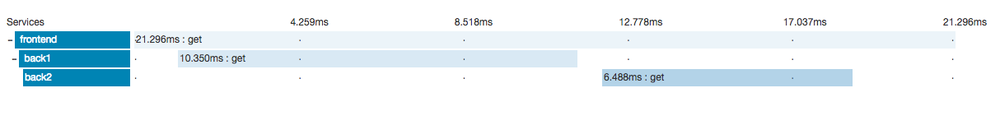
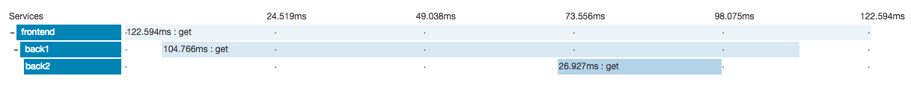

# zipkin-axios-example

Example to demonstrate distributed-tracing using **express** and **zipkin**.

## Usage
1. Clone this repository
2. cd zipkin-axios-example && npm install
3. node frontend.js
4. node back1.js
5. node back2.js
6. curl http://localhost:3000/sequence  

## ENV
Set the following env vars to configure frontend back1 or back2.

**PORT**:int -> Port for express server

**ZIPKIN_URL**:String URL of zipkin server including port

**SERVICE_NAME**:String name of the service for the tracer


## Sequencial request
### Flow

```
+-------+                            +-----------+                           +-------+ +-------+
| curl  |                            | frontend  |                           | back1 | | back2 |
+-------+                            +-----------+                           +-------+ +-------+
    |                                      |                                     |         |
    | http://localhost:3000/sequence       |                                     |         |
    |------------------------------------->|                                     |         |
    |                                      |                                     |         |
    |                                      | http://localhost:3001/firstname     |         |
    |                                      |------------------------------------>|         |
    |                                      |                                     |         |
    |                                      |                                John |         |
    |                                      |<------------------------------------|         |
    |                                      |                                     |         |
    |                                      | http://localhost:3002/lastname      |         |
    |                                      |---------------------------------------------->|
    |                                      |                                     |         |
    |                                      |                                     |     Doe |
    |                                      |<----------------------------------------------|
    |                                      |                                     |         |
    |                       Hello John Doe |                                     |         |
    |<-------------------------------------|                                     |         |
    |                                      |                                     |         |

```
### Result


## Chained request
### Flow

```
+-------+                         +-----------+                          +-------+                            +-------+
| curl  |                         | frontend  |                          | back1 |                            | back2 |
+-------+                         +-----------+                          +-------+                            +-------+
    |                                   |                                    |                                    |
    | http://localhost:3000/chain       |                                    |                                    |
    |---------------------------------->|                                    |                                    |
    |                                   |                                    |                                    |
    |                                   | http://localhost:3001/fullname     |                                    |
    |                                   |----------------------------------->|                                    |
    |                                   |                                    |                                    |
    |                                   |                                    | http://localhost:3002/lastname     |
    |                                   |                                    |----------------------------------->|
    |                                   |                                    |                                    |
    |                                   |                                    |                                Doe |
    |                                   |                                    |<-----------------------------------|
    |                                   |            ----------------------\ |                                    |
    |                                   |            | Add firstname: John |-|                                    |
    |                                   |            |---------------------| |                                    |
    |                                   |                                    |                                    |
    |                                   |                           John Doe |                                    |
    |                                   |<-----------------------------------|                                    |
    |                                   |                                    |                                    |
    |                    Hello John Doe |                                    |                                    |
    |<----------------------------------|                                    |                                    |
    |                                   |                                    |                                    |
```

### Result


#### Notes
Sequence diagrams are created using [textart.io](http://textart.io/sequence).
